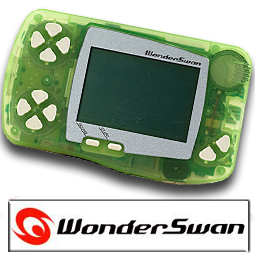
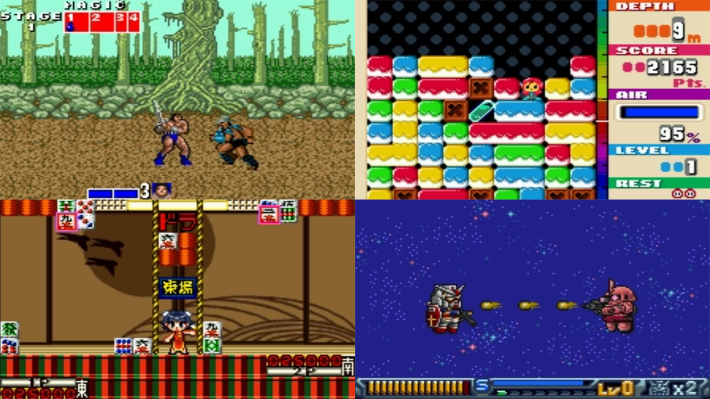

# Bandai - WonderSwan/Color (Beetle Cygne)

### Description

Standalone port of Mednafen WonderSwan to libretro, itself a fork of Cygne.

This add-on has been renamed from Cygne to Beetle Wonderswan.

### License

GPLv2

### Icon

### Fanart

Help make me fanart!

### Screenshots

